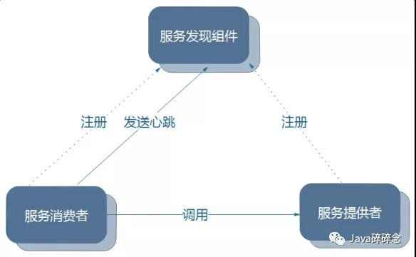

## ***\*第一轮(1小时)\****

### 1.自我介绍，项目介绍

### 2.可以说说注册中心的原理吗

注册中心主要涉及到三大角色：

服务提供者

服务消费者

注册中心

它们之间的关系大致如下：

各个微服务在启动时，将自己的网络地址等信息注册到注册中心，注册中心存储这些数据。

服务消费者从注册中心查询服务提供者的地址，并通过该地址调用服务提供者的接口。

各个微服务与注册中心使用一定机制（例如心跳）通信。如果注册中心与某微服务长时间无法通信，就会注销该实例。

微服务网络地址发送变化（例如实例增加或IP变动等）时，会重新注册到注册中心。这样，服务消费者就无需人工修改提供者的网络地址了。

### 3.你是怎么用redis的，用到了哪些数据类型

用于高速缓存，string list set hash

redis的详细介绍博客：https://blog.csdn.net/qq_43733123/article/details/104852773

### 4.你是怎么考虑某个数据是否需要加过期时间的

判断是否有时效性

### 5.说说redis的内存淘汰策略

Redis官方给的警告，当内存不足时，Redis会根据配置的缓存策略淘汰部分keys，以保证写入成功。当无淘汰策略时或没有找到适合淘汰的key时，Redis直接返回out of memory错误。

1、volatile-lru：从已设置过期时间的数据集（server.db[i].expires）中挑选最近最少使用的数据淘汰

2、volatile-ttl：从已设置过期时间的数据集（server.db[i].expires）中挑选将要过期的数据淘汰

3、volatile-random：从已设置过期时间的数据集（server.db[i].expires）中任意选择数据淘汰

4、allkeys-lru：从数据集（server.db[i].dict）中挑选最近最少使用的数据淘汰

5、allkeys-random：从数据集（server.db[i].dict）中任意选择数据淘汰

6、no-enviction（驱逐）：禁止驱逐数据

### 6.假如现在有个需求，网络爬虫需要判断某个URL是否被爬过，你会使用哪个数据类型

set类型存放，URL的md5 （16位）为set的value。

redis的key和value的长度限制为512M，一个set集合能存储33554432个URL，数量确实不多，只能多遍历几个set集合实现。

还有一种比较高级的做法是使用布隆过滤器(BoomFilter) 。

https://www.cnblogs.com/jackion5/p/13691769.html

### 7.因为redis内存有限，URL可能很多，你有没有更好的方式判断是否被爬过(这里因为前一个问题我回答了用set，所以面试官追问了我这个问题)

### 8.那你能说说布隆过滤器的实现方式吗

布隆过滤器实际就是一系列的hash函数+bitmap实现的

### 9.说说布隆过滤器的优缺点

优点：由于存放的不是完整的数据，所以占用的内存很少，而且新增，查询速度够快；

缺点： 随着数据的增加，误判率随之增加；无法做到删除数据；只能判断数据是否一定不存在，而无法判断数据是否一定存在。

### 10.再说说布隆过滤器的容错率是如何实现的

k = hash函数个数

n = 数据量大小

m = 位数组长度

p = 布隆过滤器正确率

google的guava包中提供了布隆过滤器的Java实现，默认容错率是97%。

### 11.在项目中，你使用redis是什么架构

redis-cluster架构

### 12.redis主从有缺点，你能说说缺点吗

1、主节点单点故障问题

2、大数据量时，单机内存有限

### 13.那你有什么方式能够解决这些缺点

1、使用哨兵Sentinel模式

2、数据分片cluster模式或者在业务层做业务的数据分片

### 14.读写并发的时候，会出现缓存与数据库不一致的场景，你怎么解决的

写数据只写DB

更新数据，先删除cache，再更新DB；

读数据，先读cache

### 15.能说说分布式事务的实现方案吗

https://www.cnblogs.com/jing99/p/11769093.html

1、基于XA的两阶段提交方案

两阶段提交方案开发复杂、锁定资源时间长，对性能影响很大，基本不适合解决微服务事务问题。

2、TCC解决方案

TCC方案中很多事务的处理逻辑需要应用自己编码实现，复杂且开发量大。

3、本地消息表 (异步确保)

这个方案严重依赖于数据库的消息表来管理事务，这样在高并发的情况下难以扩展，同时要在数据库中额外添加一个与实际业务无关的消息表来实现分布式事务，繁琐。

4、MQ事务消息（RocketMQ）

这种方案缺点就是实现难度大，而且主流MQ不支持。

5、分布式事务中间件解决方案

http://seata.io/zh-cn/index.html

https://github.com/codingapi/tx-lcn

### 16.基于RocketMQ实现分布式事务，能有一个具体的应用场景说一下吗

一般用于订单等有数据强一致性需求的业务

### 17.比如说有个场景，有可能会对消息进行重复消费，你怎么解决的

如果是解决短时间内的重复消费可以使用redis进行数据判重；如果是长期的可能会采用bloomfilter+数据库（es或者mysql等），根据具体业务采用合适的方案。

### 18.可以再说说RocketMQ实现分布式事务的优缺点吗

优点：最终一致性事务。

缺点：如果消费服务一直异常，那么事务的一致性就需要人工介入处理，无法自动回滚。

### 19.你刚才说的RocketMQ的使用场景。那现在有一个需求就是，服务A调用服务B，服务A执行成功了，这时候服务B执行失败了。你有什么其它方法保证数据一致性(当时脑子犯浑了答到别的方式去了。这个就两个服务的调用，对于服务B调用失败，直接用spring的事务机制就可以保证一致了)

首先B服务执行失败，那么请求还在MQ内待消费，此时最次的方案就是人工介入处理，好一点的方案就是做好自动愈合的故障处理流程。

### 20.你对消息中间件是如何选型的

根据业务的特性选择以下指标：

1、吞吐量；

2、延迟队列；

3、集群；

4、灵活度；

5、上手难易程度。

### 21.你对哪个数据库比较熟悉

mysql

### 22.可以说说Mysql的存储引擎有哪些，以及它们之间的区别吗

InnoDB：事务型数据库的首选引擎，支持事务安全表（ACID），其它存储引擎都是非事务安全表，支持行锁定和外键，MySQL5.5以后默认使用InnoDB存储引擎。

MyISAM：拥有较高的插入、查询速度，但不支持事务，不支持外键。

MEMORY：存储引擎将表中的数据存储到内存中，为查询和引用其他表数据提供快速访问。

### 23.在设计索引上，你会怎么考虑

1、查询频次；

2、查询结果的数据量，如果过大就没必要创建索引；

3、组合索引优先。

### 24.假如现在有一条慢查询，你会怎么进行排查

1、查看slow.log获取完整的sql；

2、执行explan，查看查询范围，一般是索引未命中导致；

3、如果大量的慢查询同时出现，可能需要考虑是否锁表，可以先查询mysql内执行的进程情况。

### 25.说说你在项目中使用到的设计模式

### 26.可以说一下策略模式吗

准备一组算法，并将每一个算法封装起来，使得它们可以互换

**优点：**

 1、算法可以自由切换。 

 2、避免使用多重条件判断。

 3、扩展性良好。

**缺点：**

 1、策略类会增多。

 2、所有策略类都需要对外暴露。

### 27.可以说一下JUC吗

JUC就是java.util .concurrent工具包的简称。这是一个处理线程的工具包，JDK 1.5开始出现的。

### 28.你有什么想问我的吗

## ***\*第二轮(15分钟)-HR面\****

### 1.你为什么从上家公司离职

### 2.上次听你说你面试阿里第四轮失败了，有考虑为什么失败吗

### 3.当时为什么考虑阿里

### 4.除了阿里，还有考虑别的公司吗

### 5.你的期望薪资

### 6.你对朴朴了解多少

### 7.HR进行朴朴的介绍(非常详细)

## ***\*第三轮(1小时20分钟)-技术组长面\****

### 1.自我介绍，项目介绍

### 2.项目中遇到的问题，怎么解决的

### 3.说说Eureka作为注册中心，怎么判断服务是否可用

**Euraka server**

1.启动后，从其他节点拉取服务注册信息。

2.运行过程中，定时运行 evict 任务，剔除没有按时 renew 的服务（包括非正常停止和网络故障的服务）。

3.运行过程中，接收到的 register、renew、cancel 请求，都会同步至其他注册中心节点。

备注：Eureka Server中的服务注册表中将会存储所有可用服务节点的信息

**Euraka client**

**服务提供者**

> 1.启动后，向注册中心发起 register 请求，注册服务
>
> 2.在运行过程中，定时向注册中心发送 renew 心跳，证明“我还活着”。
>
> 3.停止服务提供者，向注册中心发起 cancel 请求，清空当前服务注册信息。

**服务消费者**

> 1.启动后，从注册中心拉取服务注册信息
>
> 2.在运行过程中，定时更新服务注册信息。
>
> 3.服务消费者发起远程调用

备注：在应用启动后,将会向Eureka Server发送心跳(默认周期为30秒),

如果Eureka Server在多个心跳周期内没有接收到某 Eureka Client将会从服务注册表中把这个服务节点移除(默认90)

### 4.假如服务A调用服务B，服务B可能宕机了，或者网络故障，这时候你会怎么解决

使用ribbon做重试请求，如果重试仍然失败就考虑做一定策略的熔断降级。

### 5.服务A调用服务B，怎么保证它们之间的数据一致性

看数据是否需要回滚，如果需要回滚需要引入分布式事务策略，如果不需要回滚只要求数据最终一致性，那么可以使用rocketmq让服务B消费数据使得数据最终一致性。

### 6.zuul作为网关，你是怎么使用的，实现了哪些功能

通常在微服务中使用，与ribbon和eureka配合使用实现负载均衡和路由分发。

### 7.说说redis，你是怎么使用的

单线程的，高性能的 key-value 数据库。用户存储读写频繁的数据，提高业务执行效率。

### 8.你说到了布隆过滤器，可以具体的再说说吗，怎么实现的

就是一系列的hash函数+bitmap实现的，可是使用google的guava包中提供了布隆过滤器的Java实现，默认容错率是97%。

### 9.布隆过滤器有哪些缺点

随着数据的增加，误判率随之增加；无法做到删除数据；只能判断数据是否一定不存在，而无法判断数据是否一定存在。

### 10.说说redis的集群

（1）Redis Sentinal 着眼于高可用，在 master 宕机时会自动将 slave 提升为master，继续提供服务。

（2）Redis Cluster 着眼于扩展性，在单个 redis 内存不足时，使用 Cluster 进行分片存储。

### 11.知道redis的批处理操作吗

最常用的是通过批batch处理的方法，两种加速的方法：（mset、mget）和pipeline。

### 12.针对这些批处理的操作，比如pipeline，mget，在redis的集群场景中会出现什么情况

redis引入cluster模式后，批量获取操作pipeline，mget面临同样的问题。redis是传统的key-value的存储模式，RedisCluster将数据按key哈希到16384个slot上，每个redis node负责一部分的slot。mget需要执行的操作就是从redis node获取所有的key-value值，然后进行merge然后返回。

### 13.那你有什么方法可以解决批处理的这个问题

利用已知的hash函数算出key对应的节点，这样就可以得到一个这样的关系：Map<node, somekeys>，也就是每个节点对应的一些keys，这样将之前的o(n)的效率降低到o(node.size())。

### 14.对二进制的一些运算熟悉吗

知道与和或之类的运算，但是没有实际应用过

### 15.有一个需求，int有32位，有什么方法可以判断这个int中有多少位是1

每一位跟1进行与运算，如果结果是1，说明原来的位是1。

### 16.你也用过消息中间件，那你在使用的过程中怎么保证消息的不丢失。顺便可以举一个具体的业务场景吗

以kafka为例

1、生产者需要保证多数节点写入成功；

2、消费者需要做手动ACK，业务处理完成后响应成功。

### 17.JDK中有一个内置锁吗，你能说说它的原理吗

- synchronized同步机制
- ReentrantLock重入锁
- ReadWriteLock读写分离锁

**synchronized**

使用synchronized实现线程间同步时，我们需要理解锁的释放时机。
1.正常执行完，会释放锁
2.抛出异常时，会释放锁
其内部实现为monitorenter和monitorexit，而这两条指令是对底层的jvm指令lock和unlock的封装。

**ReentrantLock**

ReentrantLock是对Lock接口的实现。

在一个线程里面可以反复进入多次（lock()调用多次，对应的unlock()也需要和lock()的个数相同），使用重入锁时，需要注意以下几点。

1. 进入了多少次锁，则需要退出多少次锁，次数必须相同
2. 如果进入的次数比退出的次数多，则会产生死锁
3. 如果进入的次数比退出的次数少，则会出现异常java.lang.IllegalMonitorStateException
4. unlock()的调用必须放在finally中，以便保证锁的退出肯定会执行

**ReadWriteLock**

读写锁是分离锁的一种实现方式，写的时候才加锁，读的时候不加锁。

### 18.JDK也提供了一些其它的锁，你可以说说吗

### 19.那你可以说说，Synchronized和JDK中的锁的区别吗

### 20.说说ConcurrentLinkedQueue

### 21.说说阻塞队列

### 22.CompletableFuture和Future的区别

### 23.再说说你的项目吧，为什么这样分层，架构为什么这样设计

### 24.最近在看什么书(我回答了netty)

### 25.那你能说说netty的工作原理吗

### 26.一道算法题：假如内存中有100亿的int型数据，你怎么找到top10数据(除了排序，求思路)

### 27.你有什么想问我的吗

## ***\*第四轮(15分钟)-总监面\****

### 1.自我介绍，项目介绍

### 2.说说项目中你负责的模块

### 3.可以具体介绍一下其中一个模块吗

### 4.项目的团队有多少个人

### 5.能说说redis中数据类型的底层数据结构吗(zset，跳跃表)

### 6.说说排序

### 7.可以说一下堆排序吗

### 8.可以说说归并排序的思路吗

### 9.说说递归的特点和缺点