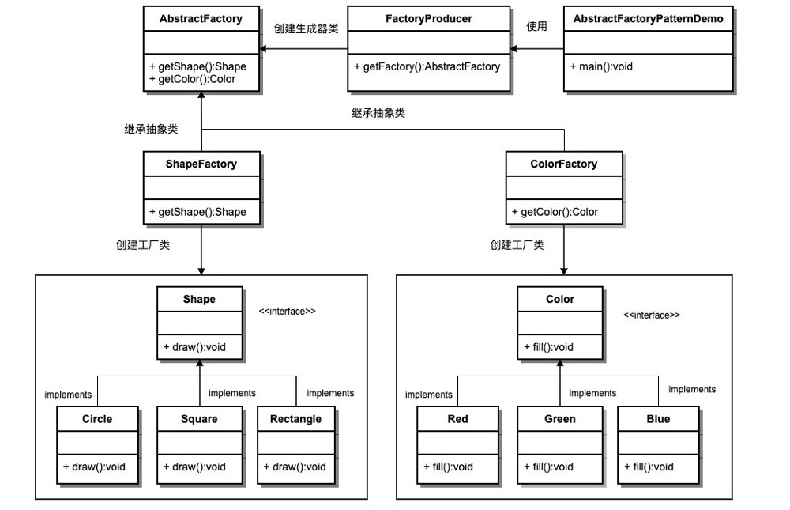

https://www.runoob.com/design-pattern/design-pattern-intro.html

# 设计模式简介

## 1、**设计模式的类型**

根据设计模式的参考书 **Design Patterns - Elements of Reusable Object-Oriented Software（中文译名：设计模式 - 可复用的面向对象软件元素）** 中所提到的，总共有 23 种设计模式。这些模式可以分为三大类：创建型模式（Creational Patterns）、结构型模式（Structural Patterns）、行为型模式（Behavioral Patterns）。当然，我们还会讨论另一类设计模式：J2EE 设计模式。

| 序号 | 模式 & 描述                                                  | 包括                                                         |
| :--- | :----------------------------------------------------------- | :----------------------------------------------------------- |
| 1    | **创建型模式** 这些设计模式提供了一种在创建对象的同时隐藏创建逻辑的方式，而不是使用 new 运算符直接实例化对象。这使得程序在判断针对某个给定实例需要创建哪些对象时更加灵活。 | 工厂模式（Factory Pattern）抽象工厂模式（Abstract Factory Pattern）单例模式（Singleton Pattern）建造者模式（Builder Pattern）原型模式（Prototype Pattern） |
| 2    | **结构型模式** 这些设计模式关注类和对象的组合。继承的概念被用来组合接口和定义组合对象获得新功能的方式。 | 适配器模式（Adapter Pattern）桥接模式（Bridge Pattern）过滤器模式（Filter、Criteria Pattern）组合模式（Composite Pattern）装饰器模式（Decorator Pattern）外观模式（Facade Pattern）享元模式（Flyweight Pattern）代理模式（Proxy Pattern） |
| 3    | **行为型模式** 这些设计模式特别关注对象之间的通信。          | 责任链模式（Chain of Responsibility Pattern）命令模式（Command Pattern）解释器模式（Interpreter Pattern）迭代器模式（Iterator Pattern）中介者模式（Mediator Pattern）备忘录模式（Memento Pattern）观察者模式（Observer Pattern）状态模式（State Pattern）空对象模式（Null Object Pattern）策略模式（Strategy Pattern）模板模式（Template Pattern）访问者模式（Visitor Pattern） |


## 2、设计模式的六大原则

**1、开闭原则（Open Close Principle）**

开闭原则的意思是：**对扩展开放，对修改关闭**。在程序需要进行拓展的时候，不能去修改原有的代码，实现一个热插拔的效果。简言之，是为了使程序的扩展性好，易于维护和升级。想要达到这样的效果，我们需要使用接口和抽象类，后面的具体设计中我们会提到这点。

**2、里氏代换原则（Liskov Substitution Principle）**

里氏代换原则是面向对象设计的基本原则之一。 里氏代换原则中说，任何基类可以出现的地方，子类一定可以出现。LSP 是继承复用的基石，只有当派生类可以替换掉基类，且软件单位的功能不受到影响时，基类才能真正被复用，而派生类也能够在基类的基础上增加新的行为。里氏代换原则是对开闭原则的补充。实现开闭原则的关键步骤就是抽象化，而基类与子类的继承关系就是抽象化的具体实现，所以里氏代换原则是对实现抽象化的具体步骤的规范。

**3、依赖倒转原则（Dependence Inversion Principle）**

这个原则是开闭原则的基础，具体内容：针对接口编程，依赖于抽象而不依赖于具体。

**4、接口隔离原则（Interface Segregation Principle）**

这个原则的意思是：使用多个隔离的接口，比使用单个接口要好。它还有另外一个意思是：降低类之间的耦合度。由此可见，其实设计模式就是从大型软件架构出发、便于升级和维护的软件设计思想，它强调降低依赖，降低耦合。

**5、迪米特法则，又称最少知道原则（Demeter Principle）**

最少知道原则是指：一个实体应当尽量少地与其他实体之间发生相互作用，使得系统功能模块相对独立。

**6、合成复用原则（Composite Reuse Principle）**

合成复用原则是指：尽量使用合成/聚合的方式，而不是使用继承。

# 一、Singleton单例

## 1、饿汉式

```java
/**
 * 饿汉式
 * 类加载到内存后，就实例化一个单例，JVM保证线程安全
 * 简单实用，推荐使用！
 * 唯一缺点：不管用到与否，类装载时就完成实例化
 * Class.forName("")
 * （话说你不用的，你装载它干啥）
 */
```

```java
private static final Mgr01 INSTANCE = new Mgr01();
```

## 2、懒汉式

### 2.1、同步锁-synchronized

```java
/**
 * lazy loading
 * 也称懒汉式
 * 虽然达到了按需初始化的目的，但却带来线程不安全的问题
 * 可以通过synchronized解决，但也带来效率下降
 */
```

```java
    public static synchronized Mgr04 getInstance() {
        if (INSTANCE == null) {
            INSTANCE = new Mgr04();
        }
        return INSTANCE;
    }
```

### 2.2、同步锁-双层检查

```java
/**
 * 在原来方法锁的基础上增加判断，需要创建时才上锁，过滤大部分创建请求
 * 理论流程上除了加锁还是会降低性能外，还是出现因转为java汇编语言优化（JIT）可能出现的指令重排序问题
 * 指令重排序问题将导致低概率情况下出现实例在创建前先返回，导致获取到的实例为null
 * 针对指令重排序问题需要加上volatile关键字，可以防止指令重排序
 * volatile的特性：可见性、原子性和有序性。volatile 的读性能消耗与普通变量几乎相同，但是写操作稍慢，因为它需要在本地代码中插入许多内存屏障指令来保证处理器不发生乱序执行。
 * （扩展）指令重排序问题产生原因：当对非 volatile 变量进行读写的时候，每个线程先从内存拷贝变量到CPU缓存中。如果计算机有多个CPU，每个线程可能在不同的CPU上被处理，这意味着每个线程可以拷贝到不同的 CPU cache 中。
 */
```


```java
private static volatile Mgr06 INSTANCE; //JIT

private Mgr06() {
}

public static Mgr06 getInstance() {
    if (INSTANCE == null) {
        //双重检查
        synchronized (Mgr06.class) {
            if(INSTANCE == null) {
                INSTANCE = new Mgr06();
            }
        }
    }
    return INSTANCE;
}
```

### 2.3、静态内部类方式

```java
/**
 * 静态内部类方式
 * JVM保证单例
 * 加载外部类时不会加载内部类，这样可以实现懒加载
 */
```

```java
private Mgr07() {
}

private static class Mgr07Holder {
    private final static Mgr07 INSTANCE = new Mgr07();
}

public static Mgr07 getInstance() {
    return Mgr07Holder.INSTANCE;
}
```

## 3、枚举类实现

```java
/**
 * 《Effective Java》的作者提供的一种方式
 * 不仅可以解决线程同步，还可以防止反序列化。
 */
```

```java
public enum Mgr08 {

    INSTANCE;

    public void m() {}

    public static void main(String[] args) {
        for(int i=0; i<100; i++) {
            new Thread(()->{
                System.out.println(Mgr08.INSTANCE.hashCode());
            }).start();
        }
    }

}
```

# 二、Strategy策略

## 1、策略模式概要

策略模式：它定义了一系列的算法，并将每一个算法封装起来，而且使它们还可以相互替换。策略模式让算法的变化不会影响到使用算法的客户。（原文：The Strategy Pattern defines a family of algorithms,encapsulates each one,and makes them interchangeable. Strategy lets the algorithm vary independently from clients that use it.）

用一句话来说，就是：“准备一组算法，并将每一个算法封装起来，使得它们可以互换”。


这个模式涉及到三个角色：
　　● 环境(Context)角色：持有一个Strategy的引用。
　　● 抽象策略(Strategy)角色：这是一个抽象角色，通常由一个接口或抽象类实现。此角色给出所有的具体策略类所需的接口。
　　● 具体策略(ConcreteStrategy)角色：包装了相关的算法或行为。


**策略模式上下文**

```java
public class Sorter<T> {

    public void sort(T[] arr, Comparator<T> comparator) {
        for(int i=0; i<arr.length - 1; i++) {
            int minPos = i;
            for(int j=i+1; j<arr.length; j++) {
                minPos = comparator.compare(arr[j],arr[minPos])==-1 ? j : minPos;
            }
            swap(arr, i, minPos);
        }
    }
    
    void swap(T[] arr, int i, int j) {
        T temp = arr[i];
        arr[i] = arr[j];
        arr[j] = temp;
    }
}
```

**抽象策略类**

```java
public interface Comparable<T> {
    int compareTo(T o);
}
```

```java
@FunctionalInterface
public interface Comparator<T> {
    int compare(T o1, T o2);

    default void m() {
        System.out.println("m");
    }
}
```

**具体策略类**

```java
public class CatWeightComparator implements Comparator<Cat> {
    @Override
    public int compare(Cat o1, Cat o2) {
        if(o1.weight < o2.weight) return -1;
        else if (o1.weight > o2.weight) return 1;
        else return 0;
    }
}

public class CatHeightComparator implements Comparator<Cat> {
    @Override
    public int compare(Cat o1, Cat o2) {
        if(o1.height > o2.height) return -1;
        else if (o1.height < o2.height) return 1;
        else return 0;
    }
}

public class DogComparator implements Comparator<Dog> {
    @Override
    public int compare(Dog o1, Dog o2) {
        if(o1.food < o2.food) return -1;
        else if (o1.food > o2.food) return 1;
        else return 0;
    }
}
```

**客户端**

```java
//选择使用的策略
Cat[] a = {new Cat(3, 3), new Cat(5, 5), new Cat(1, 1)};
Sorter<Cat> sorter = new Sorter<>();
sorter.sort(a, new CatWeightComparator());

Dog[] a = {new Dog(3), new Dog(5), new Dog(1)};
Sorter<Dog> sorter = new Sorter<>();
sorter.sort(a, new DogComparator());
```

## 2、策略模式优缺点

**优点：**

 1、算法可以自由切换。 

 2、避免使用多重条件判断。

 3、扩展性良好。

**缺点：**

 1、策略类会增多。

 2、所有策略类都需要对外暴露。

**使用场景： **

 1、如果在一个系统里面有许多类，它们之间的区别仅在于它们的行为，那么使用策略模式可以动态地让一个对象在许多行为中选择一种行为。 

 2、一个系统需要动态地在几种算法中选择一种。 

 3、如果一个对象有很多的行为，如果不用恰当的模式，这些行为就只好使用多重的条件选择语句来实现。

**注意事项：**如果一个系统的策略多于四个，就需要考虑使用混合模式，解决策略类膨胀的问题

# 三、Factory工厂

## 1、介绍

**意图：**定义一个创建对象的接口，让其子类自己决定实例化哪一个工厂类，工厂模式使其创建过程延迟到子类进行。

**主要解决：**主要解决接口选择的问题。

**何时使用：**我们明确地计划不同条件下创建不同实例时。

**如何解决：**让其子类实现工厂接口，返回的也是一个抽象的产品。

**关键代码：**创建过程在其子类执行。

**应用实例：** 1、您需要一辆汽车，可以直接从工厂里面提货，而不用去管这辆汽车是怎么做出来的，以及这个汽车里面的具体实现。 2、Hibernate 换数据库只需换方言和驱动就可以。

**优点：** 1、一个调用者想创建一个对象，只要知道其名称就可以了。 2、扩展性高，如果想增加一个产品，只要扩展一个工厂类就可以。 3、屏蔽产品的具体实现，调用者只关心产品的接口。

**缺点：**每次增加一个产品时，都需要增加一个具体类和对象实现工厂，使得系统中类的个数成倍增加，在一定程度上增加了系统的复杂度，同时也增加了系统具体类的依赖。这并不是什么好事。

**使用场景：** 1、日志记录器：记录可能记录到本地硬盘、系统事件、远程服务器等，用户可以选择记录日志到什么地方。 2、数据库访问，当用户不知道最后系统采用哪一类数据库，以及数据库可能有变化时。 3、设计一个连接服务器的框架，需要三个协议，"POP3"、"IMAP"、"HTTP"，可以把这三个作为产品类，共同实现一个接口。

**注意事项：**作为一种创建类模式，在任何需要生成复杂对象的地方，都可以使用工厂方法模式。有一点需要注意的地方就是复杂对象适合使用工厂模式，而简单对象，特别是只需要通过 new 就可以完成创建的对象，无需使用工厂模式。如果使用工厂模式，就需要引入一个工厂类，会增加系统的复杂度。

## 2、工程类型

### 2.1、简单工厂（静态工厂）

设计模式原文没有，之后大众添加

```java
/**
 * 简单工厂的可扩展性不好
 * 任意定制交通工具
 */
```

```java
public class SimpleVehicleFactory {
    public Car createCar() {
        //before processing
        return new Car();
    }

    public Broom createBroom() {
        return new Broom();
    }
}
```

### 2.2、工厂方法FactoryMethod

设计模式原文没有，之后大众添加

```java
/**
 * 任意定制生产过程
 */
```

```java
public interface Moveable {
    void go();
}
```

```java
public class CarFactory {
    public Moveable create() {
        System.out.println("a car created!");
        return new Car();
    }
}
```

### 2.3、抽象工厂

（形容词使用接口类，名词使用抽象类）



```java
/**
 * 在一个产品族里面，定义多个产品
 */
```

定义抽象工厂，抽象出三类方法属性

```java
public abstract class AbastractFactory {
    abstract Food createFood();
    abstract Vehicle createVehicle();
    abstract Weapon createWeapon();
}
```

定义现代世界工厂，继承抽象工厂

```java
public class ModernFactory extends AbastractFactory {
    @Override
    Food createFood() {
        return new Bread();
    }

    @Override
    Vehicle createVehicle() {
        return new Car();
    }

    @Override
    Weapon createWeapon() {
        return new AK47();
    }
}
```

定义魔法世界工厂，继承抽象工厂

```java
public class MagicFactory extends AbastractFactory {
    @Override
    Food createFood() {
        return new MushRoom();
    }

    @Override
    Vehicle createVehicle() {
        return new Broom();
    }

    @Override
    Weapon createWeapon() {
        return new MagicStick();
    }
}
```

使用时只需要替换那种生产模式即可

```java
public class Main {
    public static void main(String[] args) {
        AbastractFactory f = new MagicFactory();
        //AbastractFactory f = new ModernFactory();
        
        Vehicle c = f.createVehicle();
        c.go();
        Weapon w = f.createWeapon();
        w.shoot();
        Food b = f.createFood();
        b.printName();
    }
}
```

# 四、Mediator调停者

中介者模式（Mediator Pattern）


# 五、门面Facade

外观模式（Facade Pattern）